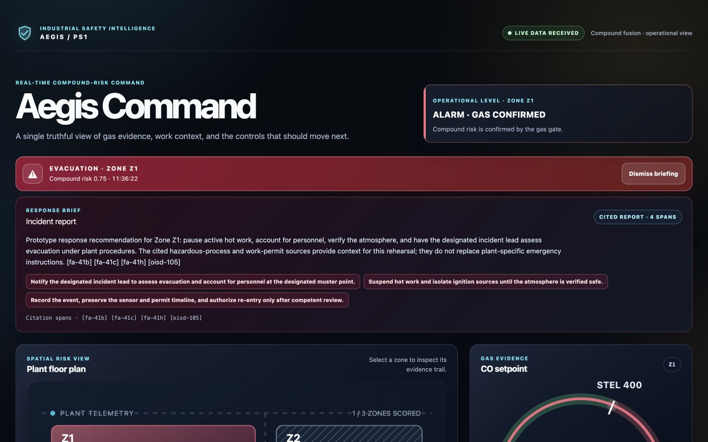
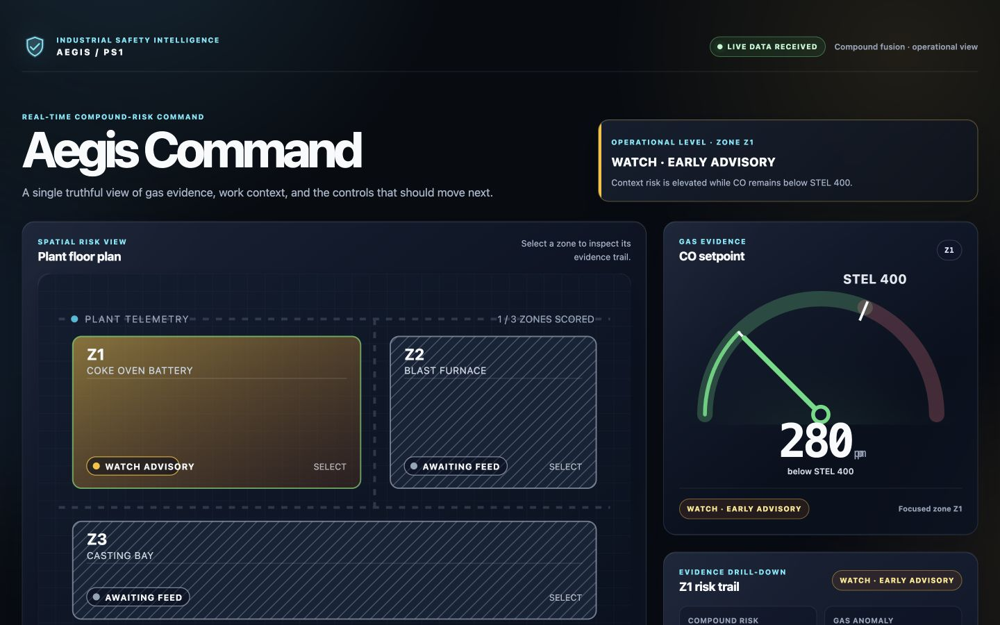
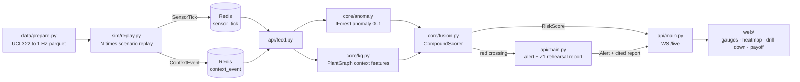

# Aegis Command

Compound-risk monitoring for industrial gas hazards.
A metal-oxide gas sensor tells you gas is rising.
It cannot tell you whether four workers, a hot-work permit, and a shift changeover are in the same zone.
Aegis Command scores that combination and separates an early advisory from a gas-confirmed evacuation decision.

ET AI Hackathon 2026 · PS1 Industrial Safety · Team Neural Ninjas



## Run it

You need Docker and about 1.5 GB of disk for the sensor archive.

```sh
git clone https://github.com/SakshamKotecha05/sniffgas.git
cd sniffgas
docker compose up --build
```

Open `http://localhost:8000` once the containers report healthy.
Compose runs two services, `app` and `redis`.
The app starts the fusion feed and its looping replay child process, then serves the built dashboard from the same port.

On the first run the app downloads the University of California Irvine (UCI) gas-sensor archive #322 and prepares 1 Hz parquet under `data/`.
That cache is bind-mounted rather than baked into the image, so later runs reuse it.
To pre-stage it, run `python data/prepare.py co`.

Check the service without a browser:

```sh
curl localhost:8000/healthz
```

### Without Docker

```sh
pip install -r requirements.txt
redis-server &
python -m api.main &
python -m sim.replay --scenario sim/scenarios/compound.yaml
```

Start the gateway before the replay.
The feed reads Redis streams from `$`, meaning connection time, so it will not consume ticks published earlier.

## The two-tier decision

A single-threshold alarm forces a choice between missing incidents and crying wolf.
Aegis Command splits the decision instead.

**WATCH** raises when hazardous operational context assembles: a permit is open, workers are present, the shift is turning over.
It is advisory and auto-clears, which buys the control room time to inspect.

**ALARM** raises only when rising gas evidence confirms that context.
It opens an evacuation response recommendation.



The gate that enforces this is a multiplicative monotone factor on the gas-residual slope (`core/fusion.py`).
Context alone cannot produce a confirmed alarm, by construction rather than by threshold tuning.

## What the evaluation shows

The frozen evaluation replays 200 seeded episodes: 50 replays for each of four scenarios, seed 42.
It compares a context-blind single-sensor baseline against compound fusion on the same replay set.

Each system uses its highest score threshold that still retains all 50 hazardous episodes:

| System | TP | FP | FN | TN |
|---|---:|---:|---:|---:|
| Single-sensor baseline | 50 | 140 | 0 | 10 |
| Compound fusion | 50 | 0 | 0 | 150 |

Read the same trade-off from the other end.
At a threshold that raises zero false alarms, the single-sensor baseline detects 0 of 50 incidents while fusion detects 50 of 50.
Stated as a false-negative rate, that control is 100% for the baseline and 0% for fusion.
At a threshold that catches every incident, the baseline raises 140 of 150 false alarms while fusion raises 0 of 150.
These are two separate operating points, not one matched-precision comparison.

### Escalation timing

Against the 400 ppm alarm anchor, across 50 of 50 crossing runs:

- **WATCH**: median 14s before the crossing
- **ALARM**: median 26s after the crossing

Fifty non-incident replays raised WATCH and auto-cleared without a confirmed alarm.

### Confounder check

The three non-compound scenarios exist to break the model.
Mean compound score by scenario:

| Scenario | Mean compound score |
|---|---:|
| `compound` | 0.92 |
| `gas_only` | 0.06 |
| `context_only` | 0.05 |
| `quiet` | 0.00 |

Tick-to-risk-score latency is p50 4.9 ms and p95 5.0 ms.
The fusion on/off ablation curve is [`eval_pr_curves.png`](eval_pr_curves.png).
Full numbers are in [`eval_report.md`](eval_report.md).

## Scope and limits

Stated once here, so nothing else in this document has to hedge.

- **The gas data is laboratory data**: UCI #322 supplies public gas-sensor dynamics recorded in a wind tunnel, not field plant telemetry. This prototype validates decision logic against those dynamics. It does not claim field performance.
- **Only plant context is scripted**: gas traces and sensor responses replay unmodified, with no synthetic gas injection. Permits, worker locations, shift changes, and maintenance events come from `sim/scenarios/*.yaml`.
- **One zone is live**: the proof is a Z1 replay. Z2 and Z3 are map architecture, not claimed multi-zone telemetry.
- **The response brief is a local rehearsal artifact**: the Z1 demo resolves citations against a committed corpus rather than calling a provider live. It is a prototype recommendation to validate against plant emergency procedures, not statutory instruction.
- **The evaluation is a seeded replay result**: 200 episodes on scenarios this team authored. It measures a decision gap, not field accuracy.
- **No return-on-investment claim**: no avoided-liability or cost figure appears anywhere in this repository, because no plant-specific baseline exists to compute one from.

## How it works



Layering runs one way: `api/` may import `core/`, never the reverse.

| Path | Role |
|---|---|
| `core/contracts.py` | Pydantic event models for sensor, context, risk, and alert messages |
| `core/anomaly/baseline.py` | Isolation Forest anomaly score and `gas_residual_slope` |
| `core/kg.py` | `PlantGraph` with zones, sensors, permits, crews, ignition sources, and two-hop features |
| `core/fusion.py` | `CompoundScorer`: sign-constrained logistic fusion, gas-evidence gate, WATCH and ALARM states |
| `core/eval/labels.py` | Pre-registered labels, frozen before any fusion training |
| `agent/` | Citation corpus and the local rehearsal report used by the Z1 demo |
| `web/` | React dashboard on the `/live` WebSocket |

## Models

### Anomaly score

An Isolation Forest with 200 estimators runs over rolling mean, standard deviation, and delta features from the 16 metal-oxide (MOX) resistance channels, on a 60s window at 1 Hz.
It returns a calibrated score in `[0, 1]`.
`gas_residual_slope` is the clipped mean channel slope, normalized by `SLOPE_SCALE = 5.0`.

The displayed carbon monoxide (CO) setpoint is reserved for the dial and the label rules.
It is excluded from model features.

### Compound fusion

The fusion scorer is Platt-calibrated logistic regression with nonnegative coefficients on all seven features, so the score can never fall while evidence rises.
Three interaction terms carry the compound thesis: anomaly × hot work, anomaly × worker count, and gas-residual slope × shift change.

Gradient boosting is the wrong tool at this sample size.
Roughly 74 positives support 10 coefficients, and monotonicity matters more in a safety path than a fraction of a point of area under the curve.

Inference multiplies the calibrated score by a sigmoid gas gate (`k = 25.0`, `x0 = 0.10`) on the normalized slope.
WATCH triggers when the ungated score clears 0.5; ALARM triggers when the gated score clears 0.5.
Because both factors are non-decreasing, states escalate as evidence accumulates and never invert.

Per-feature log-odds contributions appear in the dashboard drill-down.
Interaction contributions split half and half onto their constituent features, so every contributor name stays inside the frozen feature set.

## Reproducing the evaluation

The live feed and the evaluation share one fitting recipe through `fit_live_models()`, which delegates to `core/eval/run_eval.py`.
The Isolation Forest trains on early-trace MOX rows only, the fusion model trains on early replay scenarios, and held-out scenario windows supply the evaluation.
Both use seed 42.

The team froze labels before any fusion training, so no evaluation label can have been tuned to a model that did not yet exist.
Verify the frozen file:

```sh
shasum -a 256 core/eval/labels.py
```

| Artifact | Frozen | SHA-256 |
|---|---|---|
| `core/eval/labels.py` (commit `6fbc6a6`) | 2026-07-09 | `2f35376b1406cb02923f8bd3e2280d57976304a410fcdbfc6f5fc957ef52bee7` |

`ALARM_PPM = 400.0` is the frozen alarm anchor, taken from the India Factories Act Second Schedule short-term exposure limit for CO with no rescaling ([ADR 0001](docs/adr/0001-alarm-anchoring.md)).
The hero scenario climbs from 280 ppm to 520 ppm on the unmodified source trace.

For the CO trace, `setpoint_gas1` supplies the displayed value and label ground truth, and `setpoint_gas2` filters ethylene-confounded windows.
Neither setpoint enters model features.

### Scenarios

Every scenario replays a preselected, unmodified window from the same CO trace.
They differ in the window and in the scripted plant context.

| Scenario | CO setpoint | Scripted context | Expected behavior |
|---|---|---|---|
| `compound` | 280 → 520 ppm | Hot-work permit, four workers, shift change | WATCH, then gas-confirmed ALARM |
| `gas_only` | Rises to 533 ppm | None | Gas anomaly, no confirmed ALARM |
| `context_only` | Flat at 0 ppm | Hot-work permit, five workers, shift change | WATCH may raise and auto-clear |
| `quiet` | Flat at 0 ppm | None | No WATCH, no ALARM |

### Tests

```sh
pytest tests/ -x -q     # 45 tests
cd web && npm test      # 29 tests
```

## Demo video

3 to 4 minute walkthrough: <!-- TODO: paste hosted URL before submitting -->

## Evidence

The [claim source map](docs/submission/source-map.md) records the source for every public metric, regulatory statement, and live-behavior claim.
Architectural decisions live one file each under [`docs/adr/`](docs/adr/).
The [live QA log](docs/submission/live-qa.md) records what the dashboard actually did on the recorded runs.

## Team

Neural Ninjas: Saksham Kotecha, Deepanshu Kumar, Hitansh Sharma, Anisha Sahoo.
