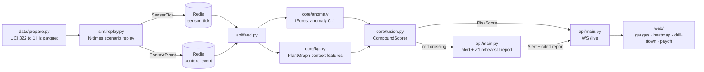

# Compound-risk monitoring for industrial gas hazards

ET AI Hackathon 2026 · PS1 Industrial Safety

**Team Neural Ninjas** · Saksham Kotecha · Deepanshu Kumar · Hitansh Sharma · Anisha Sahoo

This prototype replays real UCI #322 gas traces and adds scripted plant-context
events: hot-work permits, worker locations, shift changes, and maintenance. It
combines a metal-oxide (MOX) sensor anomaly score with that context to score
risk by zone.

The dashboard distinguishes an early WATCH from a gas-confirmed ALARM. WATCH
gives the control room time to inspect hazardous context; ALARM opens an
evacuation response recommendation when rising gas evidence supports it.

Only plant-context events are scripted. The gas traces and sensor responses are
replayed without synthetic gas injection. The live proof is a Z1 replay; Z2 and
Z3 are map architecture, not claimed live multi-zone telemetry.

UCI #322 supplies public laboratory sensor dynamics, not field plant telemetry.
This prototype validates the decision logic with those dynamics; it does not
claim field-performance validation.

## Run the demo locally

```sh
git clone https://github.com/SakshamKotecha05/sniffgas.git
cd sniffgas
docker compose up --build
```

Open `http://localhost:8000` after the containers start. Compose runs exactly
two services: `app` and `redis`. The app starts the fusion feed and its looping
replay child process, then serves the built dashboard from the same port.

On the first run, the app downloads the UCI archive and prepares 1 Hz parquet
under `data/`. The cache is bind-mounted rather than baked into the image.
Later runs reuse it. To pre-stage the data, run `python data/prepare.py co`.

Verify without the browser:

```sh
curl localhost:8000/healthz
```

### Running it without Docker

```sh
pip install -r requirements.txt
redis-server &
python -m api.main &                                    # gateway + fusion feed
python -m sim.replay --scenario sim/scenarios/compound.yaml
```

Start the gateway before the replay. The feed reads Redis streams from `$`
(connection time), so it does not consume ticks published earlier.

## Architecture



Layering is one-way: `api/` may import `core/`, never the reverse.

| Path | Role |
|---|---|
| `core/contracts.py` | Pydantic event models for sensor, context, risk, and alert messages |
| `core/anomaly/baseline.py` | IsolationForest anomaly score and `gas_residual_slope` |
| `core/kg.py` | `PlantGraph` with zones, sensors, permits, crews, ignition sources, two-hop features, and linked safety context |
| `core/fusion.py` | `CompoundScorer` with sign-constrained logistic fusion, a gas-evidence gate, and WATCH/ALARM states |
| `core/eval/labels.py` | Pre-registered labels, frozen before any fusion training |
| `agent/` | Citation corpus and optional provider escalation tooling; the Z1 demo uses a local rehearsal report |
| `web/` | React dashboard on the `/live` WebSocket |

## Evaluation snapshot

The frozen evaluation contains 200 seeded episodes: 50 replays for each of four
scenarios. It compares a context-blind single-sensor baseline with fusion on the
same replay set.

### Fixed 100% recall comparison

| System | TP | FP | FN | TN |
|---|---|---|---|---|
| Single-sensor baseline | 50 | 140 | 0 | 10 |
| Compound fusion | 50 | 0 | 0 | 150 |

Each system uses its highest score threshold that retains all 50 hazardous
episodes. At this fixed-recall control, compound fusion raises 0 of 150 false
alarms, compared with 140 of 150 for the baseline. This is a seeded replay
result, not field-performance validation or a matched-precision comparison.

### Context discrimination

At the zero-false-alarm operating point, the single-sensor baseline detects 0
of 50 incidents; fusion detects 50 of 50. At the full-recall operating point,
the single-sensor baseline raises 140 of 150 false alarms; fusion raises 0 of
150.

These are separate operating points. They show the trade-off a context-blind
baseline faces on these seeded replays.

### Two-tier escalation timing

The frozen evaluation uses a 400 ppm alarm anchor. WATCH is an advisory state:
median 14 s before the crossing, with 50 of 50 crossing runs observed. ALARM is
the gas-confirmed state: median 26 s after the crossing, with 50 of 50 crossing
runs observed.

Fifty non-incident replays raised WATCH and auto-cleared without a confirmed
ALARM.

### Confounder check

| Replay scenario | Mean compound score |
|---|---|
| `compound` | 0.92 |
| `context_only` | 0.05 |
| `gas_only` | 0.06 |
| `quiet` | 0.00 |

### Latency

Tick-to-risk-score latency is p50 4.9 ms and p95 5.0 ms. This is not an
end-to-end browser-latency measurement. The fusion ON/OFF ablation curve is
`eval_pr_curves.png`.

## Methodology and reproducibility

The live feed and evaluation use the same temporal-split fitting recipe. The
IsolationForest trains on early-trace MOX channel rows only, and the fusion model
trains on early replay scenarios. Held-out scenario windows supply the
evaluation. The seeded replays and evaluation use seed 42.

`ALARM_PPM = 400.0` is the frozen evaluation alarm anchor. The hero scenario
climbs from 280 ppm to 520 ppm without rescaling the source trace.

Labels were frozen before fusion training. Verify the frozen file:

```sh
shasum -a 256 core/eval/labels.py
```

| Artifact | Frozen | SHA-256 |
|---|---|---|
| `core/eval/labels.py` (D3 label freeze, commit `6fbc6a6`) | 2026-07-09 | `2f35376b1406cb02923f8bd3e2280d57976304a410fcdbfc6f5fc957ef52bee7` |

For the CO trace, `setpoint_gas1` supplies the displayed CO value and label
ground truth. `setpoint_gas2` filters ethylene-confounded windows. Neither
setpoint enters model features.

Tests: `pytest tests/ -x -q` · `cd web && npm test`

## Replay scenarios

All scenarios replay preselected real windows from the same CO trace. They
differ in both the selected window and the scripted plant context.

| Scenario | CO setpoint | Scripted context | Expected evaluation behavior |
|---|---:|---|---|
| `compound` | 280 → 520 ppm | Hot-work permit, four workers, shift change | WATCH, then gas-confirmed ALARM/red |
| `gas_only` | Rises to 533 ppm | None | Gas anomaly without confirmed ALARM |
| `context_only` | Flat at 0 ppm | Hot-work permit, five workers, shift change | WATCH may raise and auto-clear; no confirmed ALARM |
| `quiet` | Flat at 0 ppm | None | No WATCH or ALARM |

## Model cards

### Anomaly model

The anomaly scorer is an Isolation Forest over rolling mean, standard deviation,
and delta features from the 16 MOX resistance channels. It uses the temporal-split
procedure and returns a calibrated anomaly score in the range [0, 1].

The CO setpoint is reserved for the dial and label rules. It is excluded from
model features.

### Fusion model

The shipped fusion scorer is Platt-calibrated logistic regression with
nonnegative coefficients and three declared interactions: anomaly × hot work,
anomaly × worker count, and gas-residual slope × shift change.

The live feed fits models through `fit_live_models()`, which delegates to the
evaluation fitting recipe. It produces a compound score, per-feature
contributors, and the NORMAL, WATCH, or ALARM state.

WATCH is advisory. ALARM requires elevated context and rising gas evidence.
Dashboard display states are separate from the evaluation operating point.

## Demo video

The team will add the hosted 3 to 4 minute walkthrough after recording it. The
repository does not include a video binary.

For rehearsal, judge questions, and the manual final checks, use the
[team handbook](docs/submission/team-handbook.md) and
[submission-day checklist](docs/submission/submission-checklist.md).

## Evidence and source order

The [submission claim source map](docs/submission/source-map.md) records the
source for every public metric, regulatory statement, and live-behavior claim.
For architecture and frozen contracts, use `plan.md`, then `CONTEXT.md`, then
`docs/adr/`. For public demo claims, use `implementation.md`, `eval_report.md`,
and [the live QA record](docs/submission/live-qa.md).
